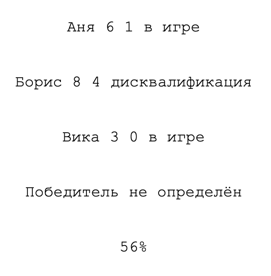
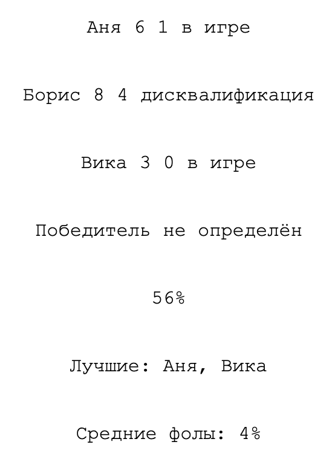

# Задача

## Переписать `day14` на методы массивов.

1. `getWinnerName` — на `find` с `?.` и `?? null`
2. `calcAveragePotted` — на `filter` + `reduce`, крайний случай с пустым списком закрыть явным `return 0`
3. `renderPlayers` — цикл `for...of` на `forEach`
4. Добавить строку «Лучшие: имена трёх игроков по убыванию забитых» — цепочкой, исходный players не мутировать
5. Добавить строку «Средние фолы: N» — через `reduce`, округлить до одного знака

### Результат до

### Результат после
